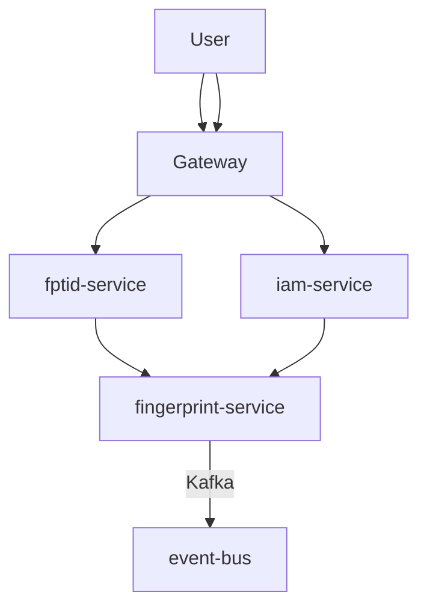

# 📦 FPT ID Platform – API & Service Documentation

Tài liệu này cung cấp mô tả tổng quan & hướng dẫn sử dụng hệ thống **FPT ID Platform** – nền tảng xác thực & định danh phân tán trong hệ sinh thái FPT.

Áp dụng kiến trúc microservices, giao tiếp qua REST, Kafka và chuẩn OIDC.  
Viết bằng Markdown – dành cho Dev, QA, PM, DevOps trong nội bộ ISC.

---

## 📘 Tính năng chính

- ✅ Xác thực: OTP, QR, FIDO/Passkey, Social Login (Google/Facebook/Apple)
- ✅ Multi-Factor & Step-up Authentication
- ✅ Theo dõi fingerprint thiết bị nghi ngờ
- ✅ Giao diện self-service: quản lý session, bảo mật

---

## 🧱 Các dịch vụ chính

| Service               | Chức năng chính                                  | Công nghệ              |
|-----------------------|--------------------------------------------------|------------------------|
| `ory-service`         | SSO nhân viên nội bộ                             | Ory Hydra + Java       |
| `webauth-service`     | Đăng nhập khách hàng (OTP / Social)             | ASP.NET Core           |
| `fingerprint-service` | Theo dõi thiết bị & nhận diện bất thường        | .NET 6.0 Console       |
| `api-gateway`         | Định tuyến request, xác thực token               | ASP.NET Core Web API   |
| `event-bus`           | Pub/Sub sự kiện                                  | Kafka                  |

---

## 📂 Các thành phần dùng chung

- `auth-lib`: Thư viện xác thực JWT (Node.js / Python)
- `common-proto`: Định nghĩa gRPC proto chung
- `config-service`: Cấu hình động phân phối qua gRPC

---

## 🧭 Sơ đồ kiến trúc tổng thể



---

## 🛠️ Hướng dẫn triển khai

### Yêu cầu hệ thống:
- Docker, Docker Compose
- .NET 6.0+, Node.js (nếu dev local)
- Kafka 2.7+, Redis (tuỳ chọn cache)
- DNS nội bộ cho các services

### Cách khởi động:
```bash
cp .env.example .env
docker-compose up --build
```

### Cấu hình mẫu `.env`
```env
JWT_SECRET=supersecretkey
FINGERPRINT_API=http://fingerprint-service:8000
KAFKA_BROKER=kafka:9092
```

---

## 🔁 API Mẫu

### Đăng nhập người dùng
```http
POST /api/v1/auth/login
Body:
{
  "phone": "0901234567",
  "otp": "123456",
  "fingerprint": "abc123"
}
```

Response:
```json
{
  "access_token": "...",
  "login_as_staff": true
}
```

👉 Xem chi tiết tại: [INTEGRATION.md](./INTEGRATION.md)

---

## 🧪 Kiểm thử tích hợp

Dùng Docker Compose:
```bash
docker-compose -f docker-compose-test.yml up --abort-on-container-exit
```

- Có sẵn service `test-runner` để mô phỏng các flow đăng nhập và tracking

---

## 📌 Roadmap (dự kiến)

- [x] Social Login (Google, Facebook, Apple)
- [x] OTP + FIDO
- [ ] Giao diện self-service
- [ ] Mở public API third-party

---

## 💬 Hỗ trợ & Liên hệ

- Email team: `fptid-platform@fsoft.com.vn`
- Teams: `#fpt-id-engineering`
- Issue tracking: Jira nội bộ ISC

---

## 🤝 Đóng góp nội bộ

Chấp nhận mọi đóng góp từ ISC:

```bash
npm run lint       # Kiểm tra format code
./scripts/test.sh  # Chạy test nhanh
```

📖 Xem thêm tại [`CONTRIBUTING.md`](./CONTRIBUTING.md)

---

## 📘 ISC Standards Library

Tài liệu chuẩn hóa dành cho toàn hệ thống ISC, bao gồm:

- ✅ Quy tắc đặt tên API
- ✅ Cấu trúc JSON phản hồi
- ✅ Mã lỗi nội bộ
- ✅ Coding convention cho tất cả service

📘 Tài liệu ISC Standards:

| Số | Tên file | Mục đích |
|----|----------|----------|
| 01 | [`01_error_codes.md`](./01_error_codes.md) | Mã lỗi chuẩn ISC |
| 02 | [`02_API_Response_Guideline_V2.md`](./02_API_Response_Guideline_V2.md) | Chuẩn cấu trúc response |
| 03 | [`03_API_Naming_Convention.md`](./03_API_Naming_Convention.md) | Quy tắc đặt tên API |
| 04 | [`04_Coding_Convention_V2.md`](./04_Coding_Convention_V2.md) | Coding convention |
| 05 | [`05_TL_QA_review_checklist.md`](./05_TL_QA_review_checklist.md) | Checklist review của QA, TL |
```

---

## 💬 Liên hệ & Hỗ trợ

- 📩 Email: 
- 💬 Teams: `

---
